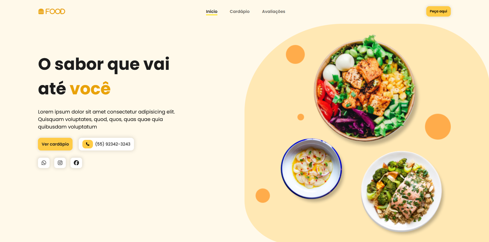
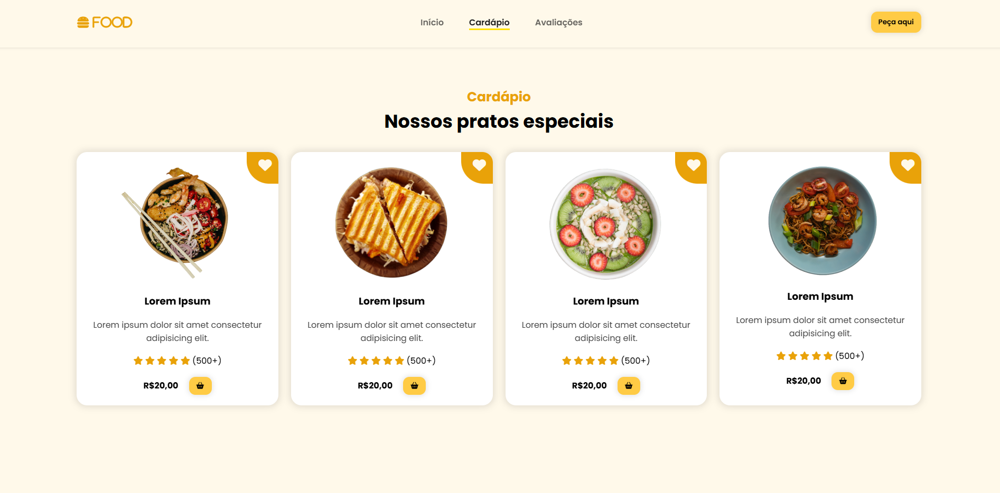
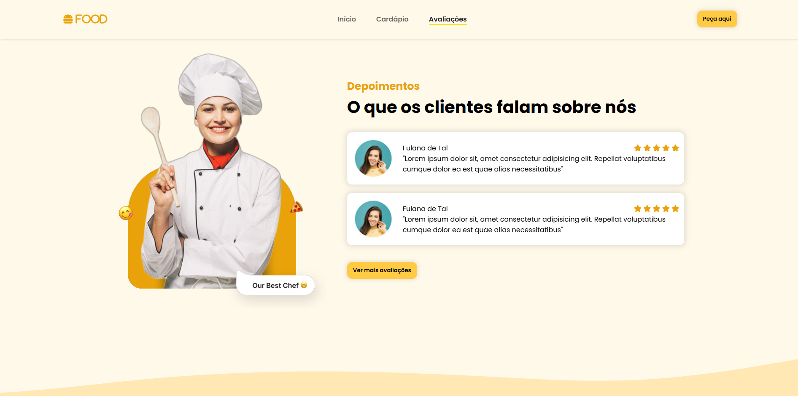

# Landing Page Food Theme

A responsive and animated landing page for a food-themed project, built with HTML, CSS, and JavaScript (jQuery).

## 🌐 Live Demo

Explore the live version here: [Landing Page Food Theme](https://landing-page-food-theme.vercel.app/)

---

## 🖼️ Screenshots





---

## 📂 Technologies Used

- **HTML5**: For the page structure.  
- **CSS3**: For styling and layout (Flexbox for responsiveness).  
- **JavaScript (jQuery)**: For interactivity and animations.  
- **Scroll Reveal**: For scroll-based animations.  

---

## 📖 How to Use

1. **Clone the repository**:  
   ```bash
   git clone https://github.com/lorenlmartins/landing-page-food-theme.git

2. **Open the project**:
Navigate to the project folder and open index.html in any browser.

3. **Run the live version**:
Alternatively, visit the deployed version: [Live Demo](https://landing-page-food-theme.vercel.app/) 
